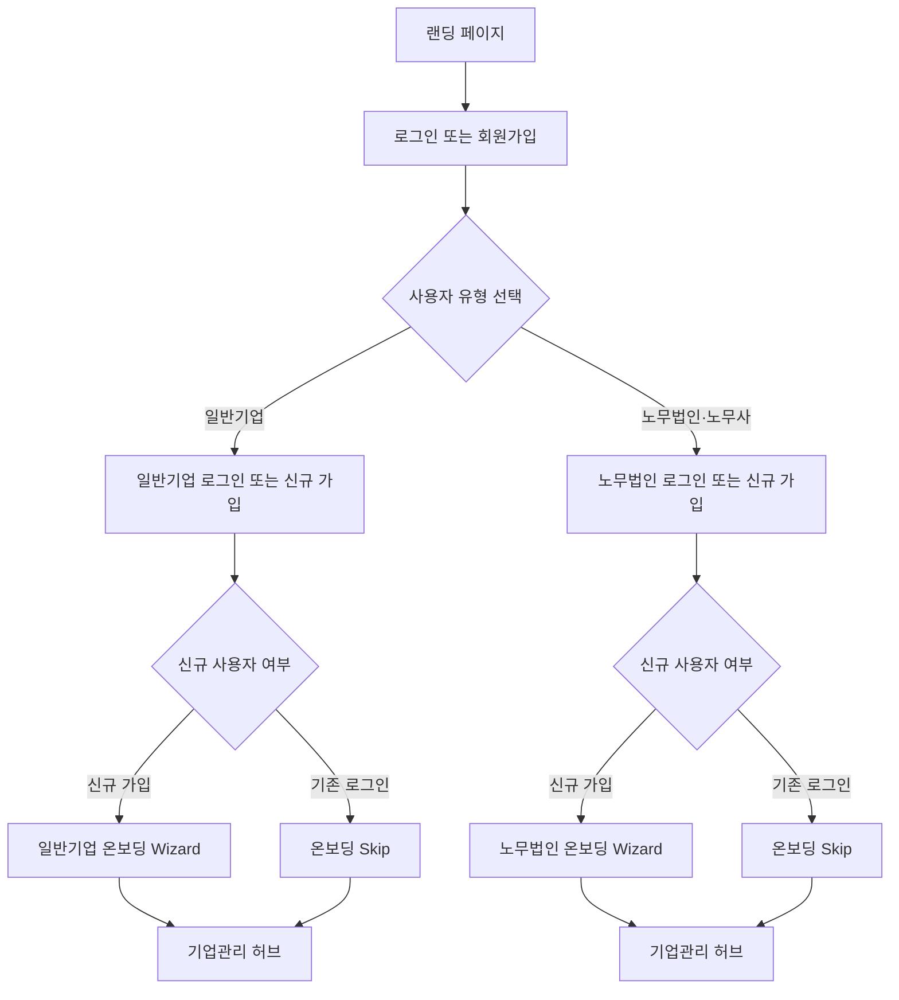
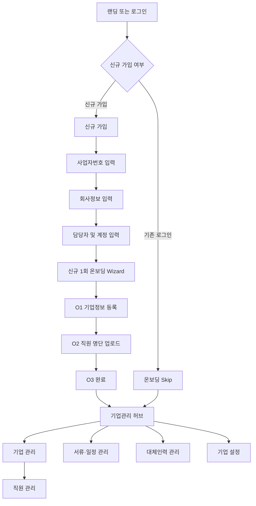
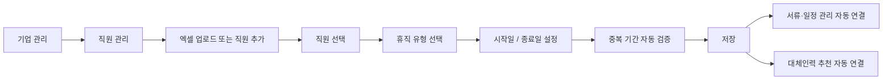
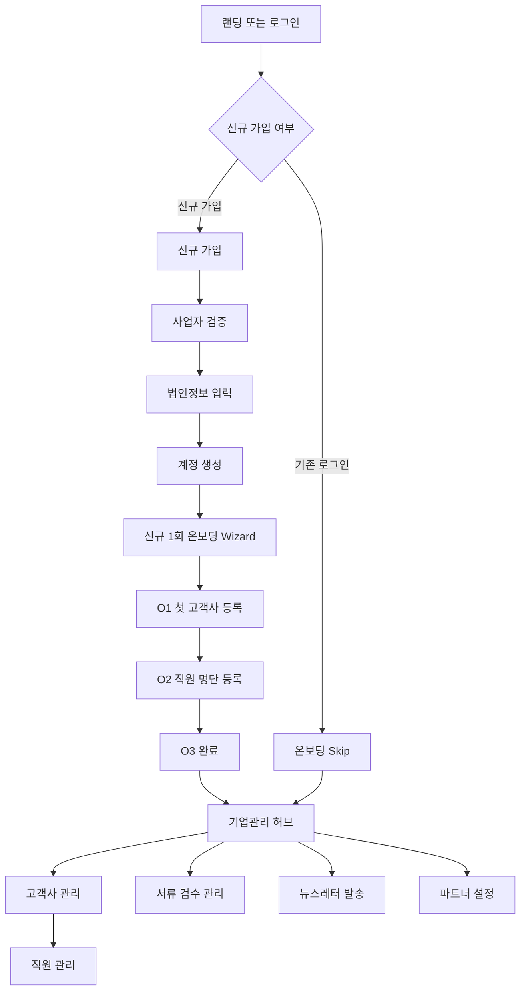

# 인센트닥 v2 — User Flow 및 IA 수정본

> 작성 기준: User Flow 수정본 이미지, IA 수정본 이미지, `인센트닥 목업_v7.html`  
> 목적: 인센트닥 v2의 사용자 유형별 이동 흐름과 화면 구조를 개발 가능한 수준으로 정리한다.

---

## 1. 문서 개요

인센트닥은 육아휴직 관련 지원금 업무를 관리하는 서비스이다.

서비스 사용자는 크게 두 유형으로 구분한다.

| 사용자 유형 | 목적 |
|---|---|
| 일반기업 | 자사 직원의 휴직 정보, 신청 서류, 일정, 예상 지원금, 대체인력을 직접 관리 |
| 노무법인·노무사 | 여러 고객사의 직원 정보, 제출 서류, 검수 상태, 뉴스레터, 파트너 설정을 통합 관리 |

두 사용자 유형은 로그인 이후 서로 다른 화면과 메뉴를 사용한다.

---

## 2. 핵심 원칙

### 2.1 일반기업과 노무법인은 독립 플로우로 운영한다

- 일반기업과 노무법인은 동일한 랜딩 페이지를 사용한다.
- 로그인 또는 회원가입 시 사용자 유형을 선택한다.
- 로그인 이후에는 사용자 유형에 따라 별도의 화면 구조를 제공한다.
- **일반기업과 노무법인의 연결·매칭 기능은 MVP 범위에서 제외한다.**
- 일반기업이 입력한 데이터가 특정 노무법인에 자동 공유되거나 연결되지 않는다.
- 노무법인은 자신이 별도로 등록한 고객사 데이터를 관리한다.

### 2.2 온보딩은 최초 입력을 위한 1회성 Wizard이다

온보딩은 서비스 사용을 시작하기 위한 최소 데이터를 최초 1회 등록하는 절차이다.

온보딩 완료 이후에는 각 운영 메뉴에서 동일한 데이터를 지속적으로 수정·관리한다.

| 구분 | 최초 등록 | 온보딩 이후 수정 위치 |
|---|---|---|
| 일반기업 기본정보 | 일반기업 온보딩 | 기업 설정 |
| 일반기업 직원·휴직 정보 | 일반기업 온보딩 | 기업 관리 > 직원 관리 |
| 노무법인 기본정보 | 노무법인 가입 | 파트너 설정 |
| 고객사 기본정보 | 노무법인 온보딩 | 고객사 관리 |
| 고객사 직원·휴직 정보 | 노무법인 온보딩 | 고객사 관리 > 직원 관리 |

### 2.3 직원 관리는 독립 메뉴처럼 보일 수 있지만 하위 화면이다

- 일반기업의 직원 관리는 개념적으로 `기업 관리`의 하위 화면이다.
- 노무법인의 직원 관리는 개념적으로 `고객사 관리`의 하위 화면이다.
- 사이드바나 버튼을 통해 빠르게 접근할 수 있지만, 데이터 소유 관계는 상위 기업 또는 고객사를 기준으로 유지한다.

---

## 3. 전체 User Flow



---

## 4. 공통 진입 흐름

### 4.1 랜딩 페이지

랜딩 페이지는 서비스 소개와 사용자 유형별 진입 버튼을 제공한다.

#### 주요 영역

| 영역 | 내용 |
|---|---|
| 서비스 소개 | 육아휴직 지원금의 예상 수급액, 제출서류, 마감일을 관리한다는 핵심 메시지 |
| 주요 기능 | 자료 등록, 조건 판정, 마감 관리, 상시 관리 |
| 이용 절차 | 입력 → 검증 → 매칭 → 준비 → 관리 |
| 사용자 유형 | 일반기업, 노무법인·노무사 |
| 신뢰 기준 | 공식 신청 흐름, 서류 상태, 마감일, 권한 분리 강조 |

#### 주요 액션

| 버튼 | 이동 |
|---|---|
| 로그인 | 로그인 화면 |
| 일반기업으로 시작 | 일반기업 로그인 또는 가입 화면 |
| 노무법인으로 시작 | 노무법인 로그인 또는 가입 화면 |

### 4.2 로그인

로그인 화면에서 사용자 유형을 선택한다.

| 사용자 유형 | 로그인 입력값 |
|---|---|
| 일반기업 | 이메일 또는 사업자번호, 비밀번호 |
| 노무법인·노무사 | 이메일 또는 사업자번호, 비밀번호 |

기존 사용자는 로그인 완료 후 온보딩을 건너뛰고 각 유형의 기업관리 허브로 이동한다.

---

## 5. 일반기업 User Flow

### 5.1 전체 흐름



### 5.2 신규 가입

#### 입력 정보

| 항목 | 필수 여부 | 비고 |
|---|---|---|
| 사업자등록번호 | 필수 | 회사 식별 |
| 회사명 | 필수 |  |
| 산업군 | 선택 | 제조업, 서비스업, IT·소프트웨어, 유통·물류, 기타 |
| 담당자 이름 | 필수 |  |
| 이메일 | 필수 | 계정 생성 |
| 비밀번호 | 필수 |  |
| 비밀번호 확인 | 필수 |  |

### 5.3 최초 1회 온보딩 Wizard

| 단계 | 화면 | 주요 입력 |
|---|---|---|
| O1 | 기업정보 등록 | 사업자등록증, 부가가치세 과세표준증명, 직원 수, 업종 |
| O2 | 직원 명단 등록 | 직원 명단 엑셀 업로드 |
| O3 | 완료 | 기본 데이터 저장 및 기업관리 허브 이동 |

#### 온보딩 이후 수정 원칙

- 직원 정보와 휴직 정보는 `기업 관리 > 직원 관리`에서 수정한다.
- 사업자 정보와 담당자 정보는 `기업 설정`에서 수정한다.

---

## 6. 일반기업 IA

```text
일반기업
├── D01 기업관리 허브
│   ├── 예상 수급액
│   ├── 신청 가능 지원금
│   ├── 마감 알림
│   └── 직원별 현황
│
├── 기업 관리
│   ├── 직원 현황 진입
│   └── 직원 관리 연결
│       └── 직원 관리
│           ├── 엑셀 업로드
│           ├── 직원 추가
│           ├── 휴직 유형 선택
│           └── 시작일 / 종료일 설정
│
├── 서류·일정 관리
│   ├── 제출서류 관리
│   ├── 휴직·복직 일정
│   └── 신청 마감 관리
│
├── 대체인력 관리
│   ├── AI 구인공고 초안
│   ├── 워크넷 게시 또는 공고 관리
│   ├── 업무분담 현황
│   └── 추가 수급액 확인
│
└── 기업 설정
    ├── 사업자 정보 수정
    ├── 담당자 정보 수정
    └── 계정·권한 관리
```

### 6.1 일반기업 화면 정의

| 화면 ID | 메뉴 | 주요 기능 | 데이터 수정 위치 |
|---|---|---|---|
| GEN-D01 | 기업관리 허브 | 예상 수급액, 신청 가능 지원금, 마감 알림, 직원별 현황 요약 | 조회 중심 |
| GEN-M01 | 기업 관리 | 직원 현황 조회, 직원 관리 화면 진입 | 직원 관리 연결 |
| GEN-M01-01 | 직원 관리 | 엑셀 업로드, 직원 추가, 휴직 유형, 시작일, 종료일 설정 | 직원·휴직 정보 수정 |
| GEN-M02 | 서류·일정 관리 | 제출서류 관리, 휴직·복직 일정, 신청 마감 관리 | 서류 및 일정 수정 |
| GEN-M03 | 대체인력 관리 | AI 구인공고 초안, 업무분담, 추가 수급액 확인 | 대체인력 관련 정보 수정 |
| GEN-S01 | 기업 설정 | 사업자 정보, 담당자 정보, 계정·권한 관리 | 기업 기본정보 수정 |

### 6.2 일반기업 직원 관리 상세 흐름



---

## 7. 노무법인·노무사 User Flow

### 7.1 전체 흐름



### 7.2 신규 가입

#### 입력 정보

| 항목 | 필수 여부 | 비고 |
|---|---|---|
| 사업자등록번호 | 필수 | 사업자 검증 |
| 법인명 | 자동 입력 | 사업자 검증 이후 자동 입력 |
| 대표 노무사 | 필수 |  |
| 이메일 | 필수 | 계정 생성 |
| 비밀번호 | 필수 |  |
| 비밀번호 확인 | 필수 |  |

#### 사업자 검증

- 사업자번호 입력 시 자동 검증한다.
- 목업에서는 비즈노 API 기반 검증 형태로 표현한다.
- 검증 완료 여부를 UI에 표시한다.

### 7.3 최초 1회 온보딩 Wizard

| 단계 | 화면 | 주요 입력 |
|---|---|---|
| O1 | 첫 고객사 등록 | 기업명, 사업자번호, 담당자 이름, 직책, 전화번호, 이메일 |
| O2 | 직원 명단 등록 | 선택한 고객사의 직원 명단 등록 |
| O3 | 완료 | 기본 데이터 저장 및 기업관리 허브 이동 |

#### 온보딩 이후 수정 원칙

- 고객사와 고객사 직원 정보는 `고객사 관리`에서 수정한다.
- 노무법인의 기본정보는 `파트너 설정`에서 수정한다.

---

## 8. 노무법인·노무사 IA

```text
노무법인·노무사
├── D01 기업관리 허브
│   ├── 관리 기업 수
│   ├── 이달 뉴스레터
│   ├── 서류 완료율
│   ├── 마감 알림
│   └── 고객사 검색
│
├── 고객사 관리
│   ├── 기업 검색
│   ├── 고객사 추가
│   ├── 담당자 관리
│   └── 직원 관리 연결
│       └── 직원 관리
│           ├── 선택 고객사 기준 조회
│           ├── 직원 추가
│           ├── 휴직 유형 선택
│           └── 시작일 / 종료일 설정
│
├── 서류 검수 관리
│   ├── 직원별 제출서류
│   ├── 검수
│   ├── 수정 요청
│   └── 승인·접수
│
├── 뉴스레터 발송
│   ├── AI 주제 추천
│   ├── 초안 생성
│   ├── 수신 기업 선택
│   └── 일괄 발송
│
└── 파트너 설정
    ├── 법인 정보
    ├── 수수료·계좌 설정
    ├── 알림 설정
    └── 계정·플랜 관리
```

### 8.1 노무법인·노무사 화면 정의

| 화면 ID | 메뉴 | 주요 기능 | 데이터 수정 위치 |
|---|---|---|---|
| NOMU-D01 | 기업관리 허브 | 관리 기업 수, 서류 완료율, 마감 알림, 고객사 검색, 뉴스레터 현황 | 조회 중심 |
| NOMU-M01 | 고객사 관리 | 기업 검색, 고객사 추가, 담당자 관리, 직원 관리 진입 | 고객사 기본정보 수정 |
| NOMU-M01-01 | 직원 관리 | 선택 고객사 기준 직원 추가, 휴직 유형, 시작일, 종료일 설정 | 고객사 직원·휴직 정보 수정 |
| NOMU-M02 | 서류 검수 관리 | 직원별 제출서류 검수, 수정 요청, 승인·접수 | 서류 상태 및 검수 의견 수정 |
| NOMU-M03 | 뉴스레터 발송 | AI 주제 추천, 초안 작성, 수신 기업 선택, 일괄 발송 | 뉴스레터 발송 관리 |
| NOMU-S01 | 파트너 설정 | 법인 정보, 수수료, 계좌, 알림, 계정, 플랜 관리 | 노무법인 기본정보 수정 |

### 8.2 고객사 직원 관리 상세 흐름


---

## 9. 데이터 소유 및 수정 위치

### 9.1 일반기업

| 데이터 | 최초 등록 위치 | 상시 수정 위치 | 비고 |
|---|---|---|---|
| 사업자 정보 | 가입 또는 온보딩 | 기업 설정 | 자사 기준 |
| 담당자 정보 | 가입 | 기업 설정 | 자사 담당자 |
| 직원 명단 | 온보딩 | 기업 관리 > 직원 관리 | 엑셀 업로드 및 개별 추가 |
| 직원별 휴직 유형 | 온보딩 또는 직원 관리 | 기업 관리 > 직원 관리 | 직접 지정 |
| 휴직 시작일·종료일 | 온보딩 또는 직원 관리 | 기업 관리 > 직원 관리 | 저장 시 기간 중복 검증 |
| 제출서류 | 운영 메뉴 | 서류·일정 관리 | 직원별 관리 |
| 대체인력 정보 | 운영 메뉴 | 대체인력 관리 | 구인공고, 업무분담 포함 |

### 9.2 노무법인·노무사

| 데이터 | 최초 등록 위치 | 상시 수정 위치 | 비고 |
|---|---|---|---|
| 법인 정보 | 가입 | 파트너 설정 | 노무법인 기준 |
| 수수료·계좌 | 운영 메뉴 | 파트너 설정 | 고객사별 또는 법인 기준 세부 정의 필요 |
| 고객사 기본정보 | 온보딩 | 고객사 관리 | 선택 고객사 기준 |
| 고객사 담당자 | 온보딩 | 고객사 관리 | 알림톡·메일 수신 |
| 고객사 직원 명단 | 온보딩 | 고객사 관리 > 직원 관리 | 고객사 선택 후 관리 |
| 직원별 휴직 유형 | 온보딩 또는 직원 관리 | 고객사 관리 > 직원 관리 | 직접 지정 |
| 제출서류 검수 상태 | 운영 메뉴 | 서류 검수 관리 | 수정 요청, 승인·접수 포함 |
| 뉴스레터 | 운영 메뉴 | 뉴스레터 발송 | 수신 기업 선택 후 발송 |

---

## 10. 온보딩과 상시 관리의 역할 구분

| 구분 | 온보딩 | 상시 관리 |
|---|---|---|
| 목적 | 서비스 사용을 위한 최소 데이터 최초 등록 | 운영 중 데이터 변경, 추가, 검수 |
| 실행 시점 | 최초 가입 직후 1회 | 로그인 이후 언제든지 |
| 일반기업 | 기업정보, 직원 명단 | 직원 관리, 서류·일정 관리, 대체인력 관리, 기업 설정 |
| 노무법인 | 첫 고객사, 고객사 직원 명단 | 고객사 관리, 서류 검수 관리, 뉴스레터 발송, 파트너 설정 |
| 기존 사용자 | 온보딩 Skip | 허브에서 바로 운영 메뉴 진입 |

---

## 11. MVP 범위

### 11.1 MVP 포함

| 구분 | 기능 |
|---|---|
| 공통 | 랜딩, 사용자 유형 선택, 로그인, 회원가입 |
| 일반기업 | 최초 온보딩, 직원 관리, 서류·일정 관리, 대체인력 관리, 기업 설정 |
| 노무법인 | 최초 온보딩, 고객사 관리, 고객사 직원 관리, 서류 검수 관리, 뉴스레터 발송, 파트너 설정 |
| 허브 | 사용자 유형별 현황 요약, 마감 알림, 주요 업무 진입 |
| 데이터 관리 | 직원별 휴직 유형, 휴직 시작일, 종료일, 제출서류 상태 관리 |

### 11.2 MVP 제외

| 제외 기능 | 사유 |
|---|---|
| 일반기업과 노무법인 연결·매칭 | 두 유형은 독립 플로우로 우선 운영 |
| 일반기업 데이터의 노무법인 자동 공유 | 별도 권한·동의·데이터 연결 정책이 필요 |
| 노무법인의 일반기업 자동 탐색 및 연결 | 추후 별도 비즈니스 정책 수립 필요 |

---

## 12. 화면 이동 규칙

### 12.1 일반기업

| 출발 화면 | 액션 | 도착 화면 |
|---|---|---|
| 랜딩 | 일반기업으로 시작 | 일반기업 로그인 |
| 일반기업 로그인 | 신규 가입 | 일반기업 회원가입 |
| 일반기업 회원가입 | 가입 완료 | 일반기업 온보딩 |
| 일반기업 온보딩 | 완료 | 일반기업 기업관리 허브 |
| 기업관리 허브 | 직원 관리 선택 | 기업 관리 > 직원 관리 |
| 직원 관리 | 저장 | 서류·일정 관리 및 대체인력 관리 데이터 연계 |
| 기업관리 허브 | 기업 설정 선택 | 기업 설정 |

### 12.2 노무법인·노무사

| 출발 화면 | 액션 | 도착 화면 |
|---|---|---|
| 랜딩 | 노무법인으로 시작 | 노무법인 로그인 |
| 노무법인 로그인 | 신규 가입 | 노무법인 회원가입 |
| 노무법인 회원가입 | 가입 완료 | 노무법인 온보딩 |
| 노무법인 온보딩 | 첫 고객사 등록 완료 | 노무법인 기업관리 허브 |
| 기업관리 허브 | 고객사 선택 | 고객사 관리 |
| 고객사 관리 | 직원 관리 선택 | 고객사 관리 > 직원 관리 |
| 직원 관리 | 저장 | 서류 검수 관리 데이터 연계 |
| 기업관리 허브 | 파트너 설정 선택 | 파트너 설정 |

---

## 13. 개발 시 유의사항

### 13.1 사용자 유형 분리

- 사용자 계정에 `user_type`을 저장한다.
- 권장 값은 `general_company`, `labor_partner`이다.
- 로그인 이후 `user_type`에 따라 라우트, 사이드바, 권한을 분리한다.
- MVP에서는 두 유형 간 데이터 관계를 생성하지 않는다.

### 13.2 데이터 계층

```text
일반기업
└── 기업
    └── 직원
        └── 휴직 정보
            ├── 제출서류
            ├── 일정
            └── 대체인력

노무법인
└── 노무법인
    └── 고객사
        └── 직원
            └── 휴직 정보
                └── 제출서류 검수
```

### 13.3 직원 관리 화면

직원 관리 화면에서 다음 데이터를 함께 다룬다.

| 항목 | 설명 |
|---|---|
| 직원 기본정보 | 이름, 부서, 직급 등 |
| 휴직 유형 | 육아휴직, 출산휴가, 육아기 근로시간 단축 등 |
| 시작일 | 휴직 시작일 |
| 종료일 | 휴직 종료일 |
| 검증 상태 | 기간 중복, 필수 입력값 누락 여부 |
| 연계 데이터 | 제출서류, 신청 일정, 대체인력 추천 |

### 13.4 허브의 역할

허브는 데이터를 직접 편집하는 화면이 아니라 업무 우선순위를 보여주는 화면이다.

- 예상 수급액
- 신청 가능 지원금
- 마감 임박 항목
- 서류 누락 항목
- 직원별 진행 상태
- 고객사별 진행 상태
- 주요 관리 화면 이동 버튼

---

## 14. 향후 확장 후보

MVP 이후 아래 기능을 검토할 수 있다.

| 기능 | 설명 |
|---|---|
| 일반기업 ↔ 노무법인 연결 요청 | 기업이 특정 노무법인에 관리 권한을 요청 |
| 데이터 공유 동의 | 기업 담당자의 명시적 동의 후 노무법인 열람 허용 |
| 역할별 권한 관리 | 대표, 담당자, 검수자, 관리자 권한 분리 |
| 알림톡·메일 연동 | 서류 요청, 수정 요청, 승인 결과 자동 발송 |
| 정책 추천 엔진 | 직원 조건과 휴직 정보를 기반으로 지원금 추천 |
| 신청 서류 자동 생성 | 입력 데이터를 기반으로 제출 서류 초안 생성 |
| 감사 로그 | 누가 언제 어떤 정보를 변경했는지 기록 |

---

## 15. 요약

- 일반기업과 노무법인은 동일한 서비스에 진입하지만 로그인 이후 독립적으로 운영한다.
- 온보딩은 최초 데이터 입력을 위한 1회성 Wizard이다.
- 온보딩 이후에는 각 운영 메뉴에서 데이터를 계속 수정한다.
- 일반기업의 직원 관리는 `기업 관리` 하위 화면이다.
- 노무법인의 직원 관리는 `고객사 관리` 하위 화면이다.
- MVP에서는 일반기업과 노무법인의 연결·매칭 기능을 제외한다.
